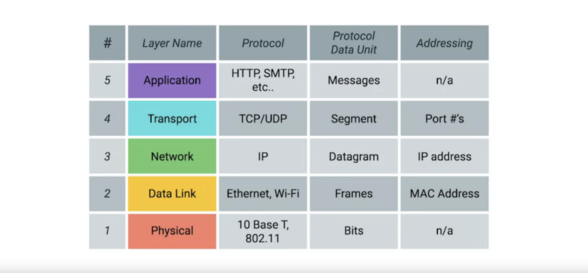
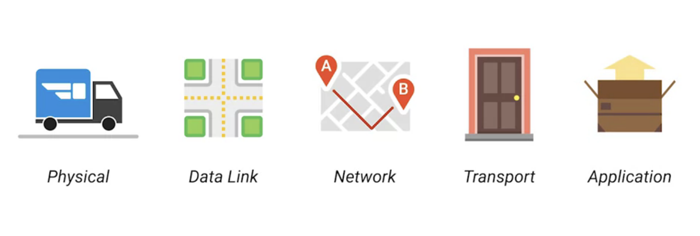

# 计算机网络快速入门[1]-前言

## 前言
在从事软件工程领域的多年里，发现大多数编程人员对于网络方面的知识都非常匮乏。然而网络又是如此的重要,以至于我们每时每刻都在与其打交道。当碰到一些网络通信问题时，许多人感到束手无策，这就是这系列`计算机网络快速入门`文章诞生的原因。如果把学习IT比作是练功，那么网络显然是修炼内功的过程。在接下来的课程中，一起来修炼吧~

## 计算机网络
* 计算机之间的交流非常像人类的方式。以口头交流为例,两个人需要说相同的语言，并且能够互相倾听以有效地进行交流。
* 如果声音太小,一个人可能必须要求另一个人重复自己说的话。如果一个人不太理解对方的表达，那么该人可能会要求对方进行解释澄清。
* 一个人可能只向另一个人讲话，或者他们可能正在与一群人讲话，通常会有问候和结束对话的方法。关键是人类在交流时遵循一系列规则，而且计算机也必须这样做。
* 计算机为了正确通信而必须遵循的一组定义的标准称为协议。计算机网络涉及计算机相互通信的所有范畴。联网确保计算机能够相互交流，发出其他计算机可以理解的协议，重复发送未完全传递的消息等。
* 就像人类如何交流一样，有许多模型用来描述计算机网络中不同层的功能。首先我们将介绍TCPIP五层模型,接着我们还将涉及另一个主要的网络模型，即OSI模型，该模型具有七个层次。如果您不知道这些模型是什么或它们如何工作，请不要担心。在本系列文章中，我们将深入探讨这些主题。
* 知道这些类型的分层模型以学习计算机网络是非常重要的，因为这是一个真正的分层事务，每一层的协议都承载着它们之上的协议。互联网或业务网络上的计算机尝试相互通信时会出现问题，通常，我们需要解决这样的问题，这就是为什么理解计算机网络如此重要。

## 计算机网络5层模型
* 要真正了解网络，我们需要了解所涉及的所有组件。我们需要谈论从设备之间相互连接的电缆到这些设备用于通信的协议的所有内容。
* 有很多模型可以帮助解释网络设备如何通信，但是在本课程中，我们将首先介绍五层模型，如下图所示

* 让我们从网络的最底层开始，那里有所谓的`物理层`。物理层听起来像是连接计算机的物理设备(包括网线和将设备连接在一起的连接器)的规范，以及描述如何通过这些连接发送信号的规范。
* 我们模型中的第二层称为数据链路层。在这一层，我们介绍我们的第一个协议。虽然物理层是关于电缆，连接器和发送信号的，但数据链路层负责定义解释这些信号的通用方法，以便网络设备可以通信。在数据链路层存在许多协议，尽管无线技术正变得越来越流行，但是最常见的协议是以太网(Ethernet)。除了指定物理层属性外，以太网标准还定义了一个协议，负责将数据获取到同一网络或链路上的节点。
* 第三层，网络层有时也称为Internet层。正是这一层允许不同的网络通过称为`路由器`的设备相互通信。通过路由器连接在一起的网络集合是一个互联网络，其中最著名的是互联网(Internet)。数据链路层负责通过单个链路获取数据，而网络层负责获取通过网络传递的数据(想一想您的家庭网络上的设备如何与Internet上的服务器连接)。网络层有助于在这两个设备之间获取数据。在此层使用的最常见协议称为IP或Internet协议。
* IP是Internet和世界上大多数小型网络的心脏。网络软件通常分为客户端和服务器两类，其中客户端应用程序发起数据请求，而服务器软件则通过网络回答请求。单个节点可能正在运行多个客户端或服务器应用程序。因此，您可能同时在PC上运行电子邮件程序和Web浏览器（这两个客户端应用程序），并且电子邮件和Web服务器都可能在同一服务器上运行。即使这样，电子邮件仍会出现在您的电子邮件应用程序中，而网页最终会出现在您的Web浏览器中。那是因为我们的下一层，传输层的作用。
* 当网络层在两个单独的节点之间传递数据时，传输层将理清应该由哪些客户端和服务器程序获取该数据。当您听说我们的网络层协议IP时，您可能想到过`TCP/IP`，这是一个很常见的词组。这是因为在第四层（传输层）中最常用的协议被称为TCP或传输控制协议。为了经常理解和解决网络问题，通常将它们统称为`TCP/IP`协议，但重要的是要知道它们是完全不同的协议，可满足不同的目的。其他传输协议也使用IP进行传输，包括称为UDP或用户数据报协议的协议。两者之间的最大区别是TCP提供了机制来确保可靠地传递数据，而UDP则不能。就目前而言，重要的是要知道网络层（在我们的示例中是IP）负责将数据从一个节点传输到另一个节点。另外，请记住，传输层（主要是TCP和UDP）负责确保数据到达在这些节点上运行的正确应用程序。
* 第五层称为应用程序层。在这一层上有很多不同的协议，正如您可能从名称中猜到的那样，它们是特定于应用程序的。允许您浏览网络或发送接收电子邮件的协议是一些常见的协议。应用程序层中正在使用的协议将是您最熟悉的，因为即使您没有意识到它们，它们也可能是您之前直接进行过交互的协议。
* 可以将计算机网络5层模型视为要交付快递的不同方面，如下所示:

* 物理层是送货卡车和道路，数据链路层是送货卡车如何从一个路口一遍又一遍地到达下一个路口，网络层确定从地址A到地址B需要走的道路，运输层确保送货司机知道如何敲门以告知包裹已到达，应用程序层是包本身的内容。

## 计算机网络OSI 7层模型
* 除了我们正在使用的五层模型外，还需要注意的是还有其他模型。 传统的TCP/IP模型只有四层，因为它没有分离物理层和数据链路层，但是与我们将要使用的模型非常相似。
* 最知名的其他模型是OSI模型，如下所示

* 自1984年成立以来，OSI(The Open Systems Interconnection)模型一直是计算机网络的最基本元素。OSI网络模型基于国际标准组织（ISO）提出的建议。OSI模型的最初目标是为设备制造商提供一套设计标准，以便他们可以相互通信。 OSI模型定义了一个层次结构，该结构在逻辑上划分了支持系统间通信所需的功能。OSI模型具有七个层，每个层具有不同的抽象级别并执行定义良好的功能
* 我们在上文介绍的的五层模型和七层OSI模型之间的主要区别在于OSI模型将应用程序层抽象为总共三层，分别是会话(Session)层、表示(Presentation)层以及应用程序层(Application)
* 会话层允许两方通过网络保持正在进行的通信，称为会话。 只要会话持续，会话两端的应用程序就可以交换数据或将数据包发送到另一端。 会话层处理会话设置，数据或消息交换，并在会话结束时关闭。 它还监视会话标识，因此只有指定的方可以参加，安全服务可以控制对会话信息的访问。
* 表示层负责网络通信期间传输的数据格式。 该层与所传输信息的语法和语义有关。 对于传出消息，它将数据转换为通用格式以进行传输。 对于传入消息，它将数据从通用格式转换为接收应用程序可以理解的格式。表示层提供常见的通信服务，例如加密，文本压缩和重新格式化。
* 应用程序层是OSI模型的顶层。 它为应用程序提供了一组接口，以获取对联网服务的访问以及对直接支持应用程序的网络服务的访问。 该层还提供应用程序访问安全性检查和信息验证。

## 总结
* 在本文中我们介绍了计算机网络快速入门写作的初衷、计算机网络的内涵以及计算机网络5层模型与ISO7层网络模型
* 在后面的文章中，我们还将介绍对网络模型的每一层做详细阐述

## 参考资料
* [osi-model-overview](https://www.sans.org/reading-room/whitepapers/standards/osi-model-overview-543)
* [osi-model](https://en.wikipedia.org/wiki/OSI_model)
