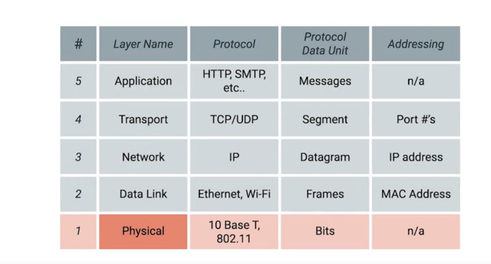
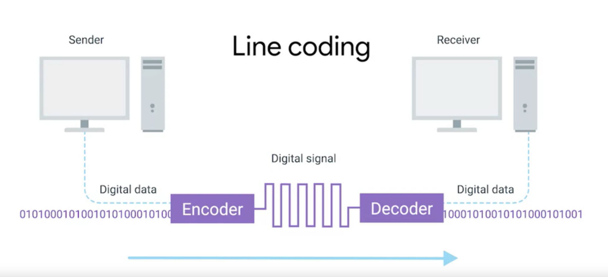
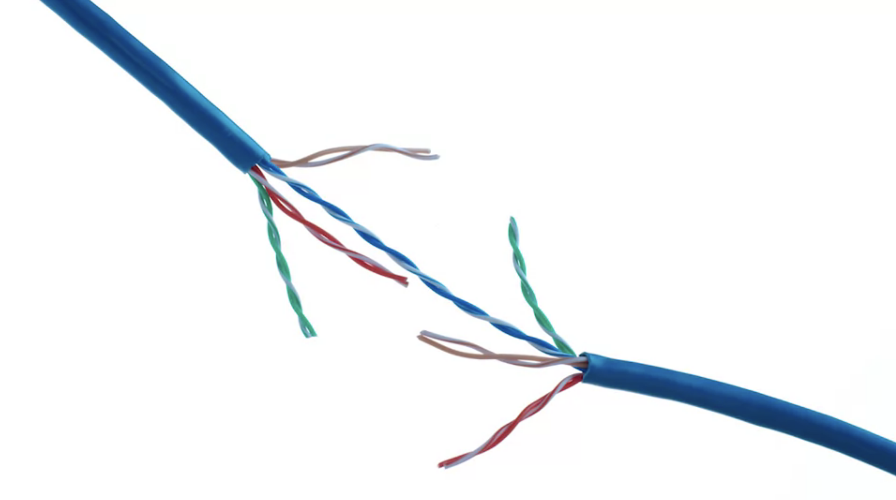
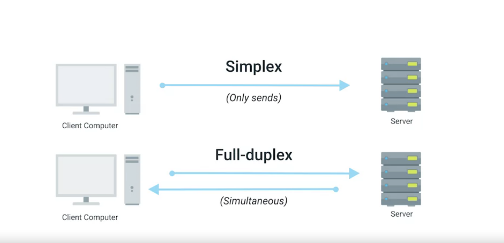
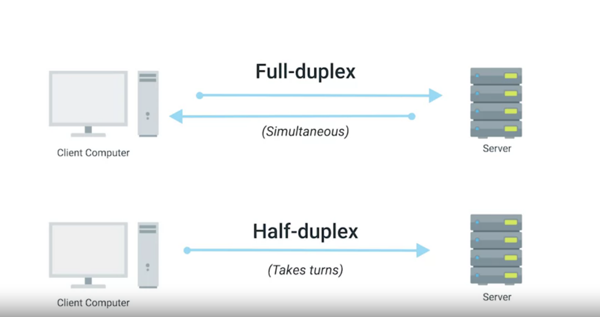
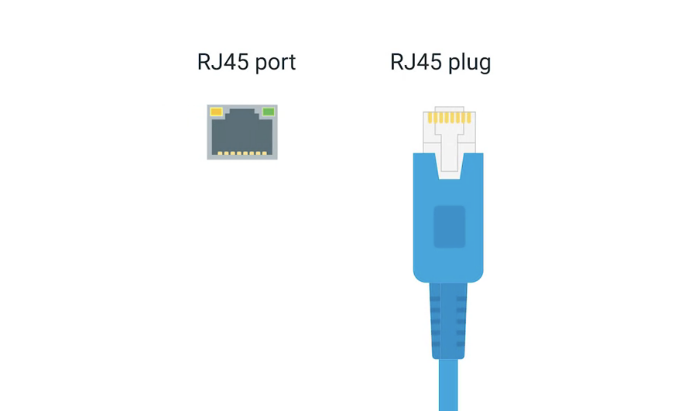
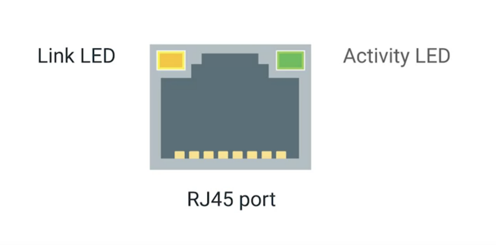
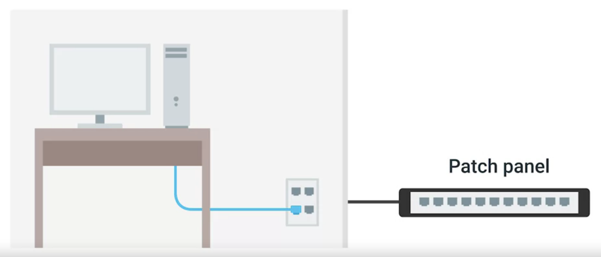
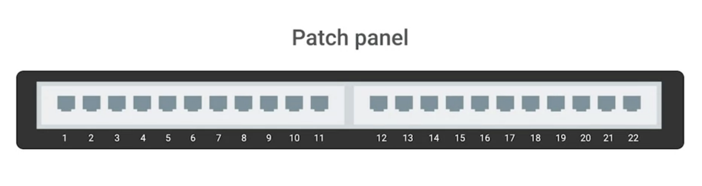

## 计算机网络快速入门[3]- 物理层、双绞线、

## 前文
* [计算机网络快速入门[1]-前言](https://zhuanlan.zhihu.com/p/107658283)
* [计算机网络快速入门[2]-网络设备-电缆、集线器、交换机、路由器](https://zhuanlan.zhihu.com/p/107658283)

## 前言
* 在上节中介绍了各种网络设备
* 在本小节将介绍物理层的细节

## 物理层
* 在某些方面，网络模型的物理层是最复杂的。它的主要重点是从链接的一端移动1和0到另一端。但是，非常复杂的数学，物理和电气工程原理正在发挥作用，以不可思议的速度跨细线传输大量数据，对我们来说幸运的是，其中大多数技术属于另一个领域

* 物理层由跨计算机网络传输`位`的设备组成。`位`是计算机可以理解的最小数据表示形式。它代表0或1。这些跨网络发送的0和1是构成`帧`和数据包的组成部分，当我们覆盖其他层时，我们将了解这些帧和数据包
* 无论您正在流式传输喜欢的歌曲，向老板发送电子邮件还是使用ATM都没关系，您真正要做的是在之间的许多不同网络的物理层上发送0和1。与之交互的服务器，将标准铜质网络电缆连接到两端的设备，它将带有恒定的电荷。通过称为`调制`(Modulation)的过程在这些网络电缆上发送一和​​零。调制是一种改变电荷在电缆上移动的电压的方式。当用于计算机网络时，这种调制方式更具体地称为线路编码(line coding)

* 线路编码允许链路两端的设备了解某种状态下的电荷为零，而另一种状态下的电荷为1。通过这种看似简单的技术，现代网络能够每秒通过一条网线移动100亿个零

## 双绞线
* 用于连接计算设备的最常见的电缆连接类型是双绞线(twisted pair)。之所以称为双绞线电缆，是因为它具有双绞在一起的铜线。这些线对充当信息的单一管道，并且它们的扭曲性质有助于防止电磁干扰和相邻线对的串扰。

* 标准`cat6`电缆在单个护套内有八根线，由四对双绞线组成。实际使用多少对取决于所使用的传输技术。但是在所有现代网络形式中，重要的是要知道这些电缆允许双工通信。双工通信是指信息可以在电缆上双向流动的概念。另一方面，称为单工通信的过程是单向的。
* 考虑一下婴儿监视器，其中数据的传输仅在一个方向上进行，从而使其成为单工通信。另一方面，电话通话是双工的，因为双方都可以听和说。通过保留一对或两对在一个方向上进行通信，网络电缆确保实现双工通信的方式。然后，他们使用另一对或两对在另一个方向进行通信。

* 因此，网络链接两侧的设备都可以在同一时间相互通信,这称为全双工。如果连接出现问题，您可能会看到网络链接质量下降并报告为半双工。半双工意味着，虽然可以在每个方向上进行通信，但一次只能通信一个设备。

* 双绞线以太网技术是一种通信协议，可确定通过双绞线电缆可以发送多少数据，可以发送数据的速度等。
* 双绞线有许多不同的变体。为了进一步了解这些内容，您可以在参考资料中阅读有关双绞线以太网技术的更多信息。

## 终端
* 物理层工作方式的最后步骤发生在我们的网络链接的终端
* 双绞线网络电缆的末端带有一个插头，该插头将各个内部电线暴露出来。最常见的插头称为RJ-45或Registered Jack 45 它是许多电缆插头规格中的一种，但迄今为止在计算机网络中最为常见

* 带有RJ-45插头的网络电缆可以连接到RJ-45网络端口。网络端口通常直接连接到组成计算机网络的设备。交换机将具有许多网络端口，因为它们的目的是连接许多设备。服务器和台式机通常只有一两个。您的笔记本电脑，平板电脑或手机可能没有任何网络接口。但是我们将在后面的模块中介绍无线网络
* 大多数网络端口都有两个小LED。一个是链接灯，另一个是活动灯。将电缆正确连接到两个均已打开电源的设备时，链接指示灯将点亮。当通过电缆主动传输数据时，活动指示灯将闪烁。很久以前，活动指示灯中的闪烁直接对应于发送一个和一个零。如今，计算机网络是如此之快，以至于活动灯除了是否有流量外，实际上并没有进行太多通信

* 在交换机上，有时链接和活动状态都使用相同的LED。它甚至可能表明其他情况，例如链接速度。您必须阅读正在使用的特定硬件，但是几乎总是可以通过端口指示灯为您提供一些故障排除数。
* 有时，网络端口未直接连接到设备。取而代之的是，可能在墙上或您的办公桌下方安装了网络端口。这些端口通常通过穿过墙壁的电缆连接到网络，这些电缆最终终止于配线架。

* 配线架是一种包含许多网络端口的设备，但没有其他作用。它只是许多电缆端点的容器。然后会有其他电缆从配线架连接到交换机或路由器，以提供对那些链路另一端的计算机的网络访问。

## 总结
* 在本文我们介绍了网络底层模型——物理层的传输的基本原理、双绞线技术介绍以及网络链接的终端

## 参考资料
* [项目链接](https://github.com/dreamerjackson/theWayToGolang)
* [作者知乎](https://www.zhihu.com/people/ke-ai-de-xiao-tu-ji-71)
* [blog](https://dreamerjonson.com/)
* [Ethernet over twisted pair](https://en.wikipedia.org/wiki/Ethernet_over_twisted_pair)